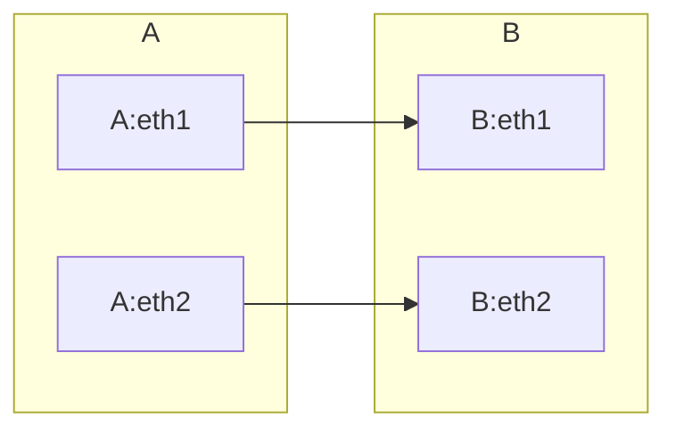

## HSR/PRP {#hsr-prp}

HSR/PRP 全称分别为 High-availability Seamless Redundancy（高可靠性无缝冗余）与 Parallel Redundancy Protocol（并行冗余协议）.一个专注于解决高可靠性自动化网络传输的标准.kkjkjkn


## 环境说明 {#环境说明}

支持 HSR/PRP 功能的内核为 5.10.120 以上，系统环境 Debian11.5，系统自带内核为 5.10.0-18-amd64,采用 5.19.11 的内核。


## 编译内核 {#编译内核}


### 配置安装源 {#配置安装源}

/etc/apt/source.list

```cfg
# loop iso
deb [trusted=true ] cdrom:[Debian GNU/Linux 11.5.0 _Bullseye_ - Official amd64 DVD Binary-1 20220910-10:40]/ bullseye contrib main

deb http://security.debian.org/debian-security bullseye-security main contrib
deb-src http://security.debian.org/debian-security bullseye-security main contrib

deb http://deb.debian.org/debian/ bullseye-updates main contrib
deb-src http://deb.debian.org/debian/ bullseye-updates main contrib

# sid
deb http://ftp.cn.debian.org/debian sid main
```

-   [trusted=true] : 本地 iso 文件增加信任
-   sid： 增加 debian 滚动源，解决安装 libelf-dev 时无法检索的总理


### 安装软件库 {#安装软件库}

```bash
apt update
apt install libncurses-dev
apt install flex
apt install bison
apt install libssl-dev
```


### 配置编译安装 {#配置编译安装}

```bash
cd kernel-src/
cp /boot/config-$(uname -r) .config

make menuconfig
# Main menu --> Networking support --> HSR/PRP
# <load> <save>

# exit menuconfig(<ESC><ESC>)

make -j4

# install modules
make modules_install

# install kernel
make install

# start priority
update-initramfs -c -k 5.19.11

update-grub
```


### 特别说明 {#特别说明}

libelf-dev 软包在 iso 文件或者 bullseys 在线源中均未找到，采用 sid 源安装成功。

-   <https://packages.debian.org/zh-cn/sid/amd64/libelf-dev/download>
-   Asia repository

<!--listend-->

```text
ftp.cn.debian.org/debian
ftp.jp.debian.org/debian
ftp.kr.debian.org/debian
ftp.hk.debian.org/debian
ftp.tw.debian.org/debian
```


## 编译安装包 {#编译安装包}

将内核源码编译成


### 安装软件库 {#安装软件库}

```bash
apt install fakeroot
apt install dpkg-dekv
apt install rsync
```


### 编译包 {#编译包}

```bash
make -j 4  deb-pkg
```

在编译目录上层目录生成内核和头文件的安装包（deb 格式）。


## 测试环境 {#测试环境}


### 连接方式 {#连接方式}

分别配置 A、B 两台装置的 HSR/PRP 网络以及 IP，假设配置均配置 A、B 的 eth1 和 eth2，A 机的 eth1 和 eth2 分别连接 B 机的 eth1 和 eth2，此时 A 机 ping B 机的 prp0 设备是通的，拔掉任意的 eth0 和 eth1，prp0 网络应能正常连接不断网。




### net-tools 配置 {#net-tools-配置}


#### 配置 MAC {#配置-mac}

配置端口有一样的 MAC 地址：

```bash
ifconfig eth1 0.0.0.0 down && ifconfig eth2 0.0.0.0 down
ifconfig eth1 hw ether 70:FF:76:1C:0E:8C && ifconfig eth2 hw ether 70:FF:76:1C:0E:8C
```


#### HSR 配置 {#hsr-配置}

```bash
thtool -K eth1 hsr-rx-offload on && ethtool -K eth2 hsr-rx-offload on
ifconfig eth1 up && ifconfig eth2 up
ip link add name hsr0 type hsr slave1 eth1 slave2 eth2 supervision 45 version 1
ifconfig hsr0 192.168.2.20
```


#### PRP 配置 {#prp-配置}

```bash
ethtool -K eth1 prp-rx-offload on && ethtool -K eth2 prp-rx-offload on
ifconfig eth1 up && ifconfig eth2 up
ip link add name prp0 type hsr slave1 eth1 slave2 eth2 supervision 45 proto 1
ifconfig prp0 192.168.2.20
```


### ip 配置 {#ip-配置}

Getting Started

To try out HSR/PRP (assuming two supported platforms are set up already, and the ethernet ports are eth1/eth2):

Connect the Ethernet ports between devices, eth1 to eth1 and eth2 to eth2. (This acts as a 2 node ring for HSR, or a 2 node point-to-point for PRP)

```bash
# Bring down both the ethernet interfaces
ip link set eth1 down && ip link set eth2 down

# Configure both ports to have the same MAC address
ip link set dev eth1 address 70:FF:76:1C:0E:8C && ip link set dev eth2 address 70:FF:76:1C:0E:8C

# Bring up both the ethernet interfaces
ip link set eth1 up && ip link set eth2 up

# Create HSR or PRP feature
# For HSR
ip link add name hsr0 type hsr slave1 eth1 slave2 eth2 supervision 45 version 1
# For PRP
ip link add name prp0 type hsr slave1 eth1 slave2 eth2 supervision 45 proto 1

# Assign an IP address to the HSR/PRP interface
# For HSR
ip addr add 192.168.2.20 dev hsr0

# For PRP
ip addr add 192.168.2.20 dev prp0
```

With the above configuration, if a ping is run between the two platforms on the HSR/PRP interface, the ping will continue even if one of the connections is removed.


### 脚本化配置 {#脚本化配置}


#### Linux HSR PRP Support {#linux-hsr-prp-support}

```shell
#!/bin/sh

if [ "$#" != "4" ]
then
    echo "$0 <hsr|prp> <intf1> <intf2> <ip addr>"
    exit
fi

if [ "$1" != "hsr" ] && [ "$1" != "prp" ]
then
    echo "$0 <hsr|prp>"
    exit
fi

if [ "$1" == "hsr" ]
then
    if=hsr0
else
    if=prp0
fi

ifa=$2
ifb=$3

ip=$4
mac=`ifconfig $ifa | grep ether | cut -d " " -f 10`

echo "ip=$ip"
echo "if=$if"
echo "mac=$mac"
echo "slave-a=$ifa"
echo "slave-b=$ifb"
if [ "$1" == "hsr" ]
then
    ip link delete prp0  2> /dev/null
else
    ip link delete hsr0  2> /dev/null
fi

ip link set $ifa down
ip link set $ifb down
sleep 1

ip link set dev $ifa address $mac
ip link set dev $ifb address $mac

ip link set $ifa up
sleep 1

ip link set $ifb up
sleep 1

if [ "$1" == "hsr" ]
then
    ip link add name $if type hsr slave1 $ifa slave2 $ifb supervision 45 version 1
else
    ip link add name $if type hsr slave1 $ifa slave2 $ifb supervision 45 proto 1
fi
sleep 3

ip addr add $ip/24 dev $if
ip link set $if up
```

-   run-script

    ```shell
    # hsr interface
    sh ./<script_filename.sh> hsr eth1 eth2 192.168.2.20

    # prp interface
    sh ./<script_filename.sh> prp eth1 eth2 192.168.2.20
    ```


#### Linux HSR Offload Support {#linux-hsr-offload-support}

```shell
#!/bin/sh

#For non offload - sh hsr_setup.sh hsr_sw <INTF_A> <INTF_B> <HSR_INTF_IP_ADDR>
#For offload - sh hsr_setup.sh hsr_hw <INTF_A> <INTF_B> <HSR_INTF_IP_ADDR>

if [ "$#" != "4" ]
then
        echo "$0 <hsr_sw/hsr_hw> <intf1> <intf2> <ip addr>"
        exit
fi

if [ "$1" != "hsr_sw" ] && [ "$1" != "hsr_hw" ]
then
        echo "$0 <hsr_sw|hsr_hw>"
        exit
fi

if=hsr0

ifa=$2
ifb=$3

ip=$4
mac=`ifconfig $ifa | grep ether | cut -d " " -f 10`

device="platform/"
device+=`dmesg | grep $ifa | grep icssg-prueth | grep -m 1 "Link is Up" | awk '{print $4}'`

echo "ip=$ip"
echo "if=$if"
echo "mac=$mac"
echo "slave-a=$ifa"
echo "slave-b=$ifb"
echo "device=$device"

ip link delete hsr0  2> /dev/null

ip link set $ifa down
ip link set $ifb down
sleep 1

if [ "$1" == "hsr_hw" ]
then
        ethtool -k $ifa | grep hsr
        ethtool -K $ifa hsr-fwd-offload on
        ethtool -k $ifa | grep hsr

        ethtool -k $ifb | grep hsr
        ethtool -K $ifb hsr-fwd-offload on
        ethtool -k $ifb | grep hsr

        devlink dev param set $device name hsr_offload_mode value true cmode runtime
fi

ip link set dev $ifa address $mac
ip link set dev $ifb address $mac

ip link set $ifa up
sleep 1

ip link set $ifb up
sleep 1

ip link add name $if type hsr slave1 $ifa slave2 $ifb supervision 45 version 1

sleep 3

ip addr add $ip/24 dev $if
ip link set $if up
```

To create HSR interface with IP address 192.168.2.20 using eth1 and eth2 and port-to-port forwarding offloaded, run the script by passing the arguments as below:

```bash
sh ./<script_filename.sh> hsr_hw eth1 eth2 192.168.2.20
```


### 特别说明 {#特别说明}

-   在参考示例中 eth1 和 eth2 需要设置同样的 MAC，实测不必要。
-   命令不支持 `proto` 参数，去掉 `proto 1` 以及 `supervision 45` 实测也可。
    -   -ip link add name prp0 type hsr slave1 eth1 slave2 eth2 supervision 45 proto 1-
    -   ip link add name hsr0 type hsr slave1 eth1 slave2 eth2
    -   ip link add name prp0 type hsr slave1 eth1 slave2 eth2


### 参考 {#参考}

-   [HSR/PRP](https://software-dl.ti.com/processor-sdk-linux/esd/AM65X/latest/exports/docs/linux/Industrial_Protocols_HSR_PRP.html)配置 1
-   [HSR/PRP](https://software-dl.ti.com/processor-sdk-linux/esd/AM64X/08_01_00_39/exports/docs/linux/Foundational_Components/Kernel/Kernel_Drivers/Network/HSR_PRP.html)配置 2
-   [HSR/PRP](https://software-dl.ti.com/processor-sdk-linux/esd/AM64X/09_00_00_03/exports/docs/linux/Foundational_Components/Kernel/Kernel_Drivers/Network/HSR_PRP.html)配置脚本