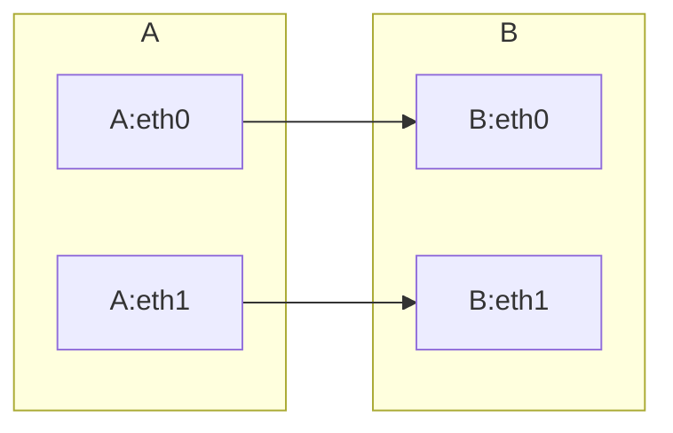

## 前言 {#前言}

-   开源的文本驱动图表生成工具.
-   Mermaid 可以作为 JavaScript 库使用，也可以作为独立的命令行工具使用。
-   在文本编辑器中编写图表定义，而无需使用专业的图表工具或图形用户界面。
-   支持自定义部署，调用 Mermaid API 使用。
-   语言风格类似于 Markdown，易于学习和使用。

支持的图表类型：

| 类型  | type               | 描述           |
|-----|--------------------|--------------|
| 流程图 | （Flowchart）      | 展示过程、决策和操作流程。 |
| 序列图 | （Sequence Diagram） | 展示对象之间的交互顺序。 |
| 甘特图 | （Gantt Chart）    | 展示项目计划和进度。 |
| 词云图 | （Class Diagrat）  | 展示类的结构和关系。 |
| 饼图  | （Pie Chart）      | 展示数据占比。 |
| 捷径图 | （Shortcut）       | 简单展示快捷方式。 |
| 状态图 | （State Diagram）  | 展示对象状态的转换。 |
| 用户旅程图 | （Journey）        | 展示用户如何与应用程序交互。 |

Mermaid 还支持其他类型的图表，例如任务图（Task）和网路拓扑图（Network Topology），以及自定义的图表类型。


## 高阶语法 {#高阶语法}


### 常见的关键字或符号 {#常见的关键字或符号}

| 关键字或符号          | 描述                |
|-----------------|-------------------|
| graph                 | ：定义一个图表。    |
| subgraph              | ：定义一个子图表，用于将多个形状分组。 |
| pie                   | ：定义一个饼图。    |
| class 或 interface    | ：定义一个类或接口形状。 |
| participant           | ：定义一个参与者形状。 |
| note                  | ：定义一个注释形状。 |
| title                 | ：定义图表标题。    |
| style                 | ：定义形状的样式。  |
| click                 | ：定义一个可以单击的形状。 |
| loop 或 alt           | ：定义一个循环或条件块。 |
| activate 或 deactivate | ：定义对象的激活或停用状态。 |
| subroutine            | ：定义一个子程序。  |

1.  --&gt; 或 -|&gt;
    -   定义两个形状之间的连接，
    -   --&gt; 表示直线连接，
    -   -|&gt; 表示垂直连接。
2.  --- 或 --
    -   定义形状之间的水平或垂直线条。
3.  =&gt; 或 ==&gt;
    -   定义形状之间的带箭头的连接线，
    -   =&gt; 表示直线箭头
    -   ==&gt; 表示双线箭头。


### 子图 {#子图}

````markdown

````

-   output


### 连接 {#连接}

1.  右箭头：A --&gt; B
2.  左箭头：A &lt;-- B
3.  双向箭头：A &lt;--&gt; B
4.  右箭头带空心三角形：A --▷ B
5.  左箭头带实心三角形：A ◁-- B
6.  双向箭头带空心菱形：A --o B
7.  自我引用带圆形箭头：A ==&gt; A


### style {#style}

**语法**

> style &lt;shape-id&gt; &lt;style-attr&gt;:&lt;style-value&gt;[;&lt;style-attr&gt;:&lt;style-value&gt;]...

-   &lt;shape-id&gt; 是形状的 ID，
-   &lt;style-attr&gt; 是样式属性，
-   &lt;style-value&gt; 是样式属性的值。
-   可以为形状设置多个样式属性，
-   多个样式属性之间用分号 ; 分隔。


### loop {#loop}

loop 关键字用于定义一个循环块，它可以让一组形状重复多次。循环块的语法如下：

> loop [循环次数]
>    [形状 1]
>    [形状 2]
>    ...
> end


### alt {#alt}

alt 关键字用于定义一个条件块，它可以根据条件选择不同的路径。条件块的语法如下：

> alt [条件 1]
>    [路径 1]
> else if [条件 2]
>    [路径 2]
> else
>    [路径 3]
> end


## 常用图表 {#常用图表}


### 流程图 {#流程图}

````markdown
graph LR
   A-->B;
   B-->C;
   C-->D;
````

-   parameter
    

-   output

    ```mermaid
    graph LR
    A-->B;
    B-->C;
    C-->D;
    ```


### 时序图 {#时序图}

````markdown
sequenceDiagram
participant User
participant System
User->>System: 发送请求
System->>User: 返回响应
````

-   parameter
    

-   output

    ```mermaid
    sequenceDiagram
    participant User
    participant System
    User->>System: 发送请求
    System->>User: 返回响应
    ```


### 甘特图 {#甘特图}

````markdown
gantt
title 甘特图示例
dateFormat  YYYY-MM-DD
section 项目A
任务1           :a1, 2023-05-01, 10d
任务2           :after a1  , 20d
section 项目B
任务3           :2023-05-15  , 12d
任务4           :2023-05-20  , 10d
````

-   parameter
    

-   output

    ```mermaid
    gantt
    title 甘特图示例
    dateFormat  YYYY-MM-DD
    section 项目A
    任务1           :a1, 2023-05-01, 10d
    任务2           :after a1  , 20d
    section 项目B
    任务3           :2023-05-15  , 12d
    任务4           :2023-05-20  , 10d
    ```


### 状态图 {#状态图}

````markdown
stateDiagram
[*] --> 暂停
    暂停 --> 播放
    暂停 --> 停止
    播放 --> 暂停
    播放 --> 停止
    停止 --> [*]
````

-   parameter
    

<!--listend-->

-   output

    ```mermaid
    stateDiagram
    [*] --> 暂停
    暂停 --> 播放
    暂停 --> 停止
    播放 --> 暂停
    播放 --> 停止
    停止 --> [*]
    ```


### 饼图 {#饼图}

````markdown
pie
   title Example Pie Chart
   "First slice": 30
   "Second slice": 20
   "Third slice": 50
````

-   parameter
    -   colors:用于设置各个数据选项对应的颜色。默认情况下,Mermaid 会自动为每个数据选项分配一种颜色,也可以手动指定颜色;
    -   labelFormat:用于设置饼形图上的数据标签格式,可以是数字、百分比等。
    -   labelPosition:用于设置数据标签的位置,可以是饼形图内部、外部或者中心位置

<!--listend-->

-   output

    ```mermaid
    pie
    title Example Pie Chart
    "First slice": 30
    "Second slice": 20
    "Third slice": 50
    ```


### 类图 {#类图}

````markdown
classDiagram
class Animal {
        +name: string
        +age: int
        +eat(food: string): void
    }

class Dog {
        +sound: string
        +bark(): void
    }

class Cat {
        +climb(): void
    }

    Animal <|-- Dog
    Animal <|-- Cat
````

-   parameter
    

<!--listend-->

-   output

      ```mermaid
    classDiagram
    class Animal {
            +name: string
            +age: int
            +eat(food: string): void
        }

    class Dog {
            +sound: string
            +bark(): void
        }

    class Cat {
            +climb(): void
        }

        Animal <|-- Dog
        Animal <|-- Cat
        ```


### 用户旅程 {#用户旅程}

````markdwon
journey
title 用户旅程图
section 登录
已有账号         : 已有账号页面
点击登录         : 登录操作
登录成功         : 登录成功页面
section 注册
没有账号         : 注册页面
点击注册         : 注册操作
注册成功         : 注册成功页面
````

-   output

    ```mermaid
    journey
    title 用户旅程图
    section 登录
    已有账号         : 已有账号页面
    点击登录         : 登录操作
    登录成功         : 登录成功页面
    section 注册
    没有账号         : 注册页面
    点击注册         : 注册操作
    注册成功         : 注册成功页面
    ```


## 参考 {#参考}

-   [官方文档](https://mermaid-js.github.io/mermaid/#/)
-   [Mermaid Live Edit](https://link.zhihu.com/?target=https%3A//mermaid.live/edit%23pako%3AeNpVjk2Lg0AMhv9KyGkL9Q94WGh1t5fCFurN6SFo7AztfDBGpKj_fcd62c0pvM_zhkzY-JYxx-7px0ZTFKhK5SDNoS50NL1Y6m-QZZ_ziQWsd_ya4fhx8tBrH4Jx993mH1cJium8agyijXssGyre_R_HM5T1mYL4cPtLqtHP8FWbi07n_xMdObW-647yjrKGIhQU3wru0XK0ZNr0_rQmCkWzZYV5WlvuaHiKQuWWpNIg_vpyDeYSB97jEFoSLg3dI9ktXH4B_cJWqw)
-   [Mermaid 使用教程：从入门到精通](https://zhuanlan.zhihu.com/p/627356428)